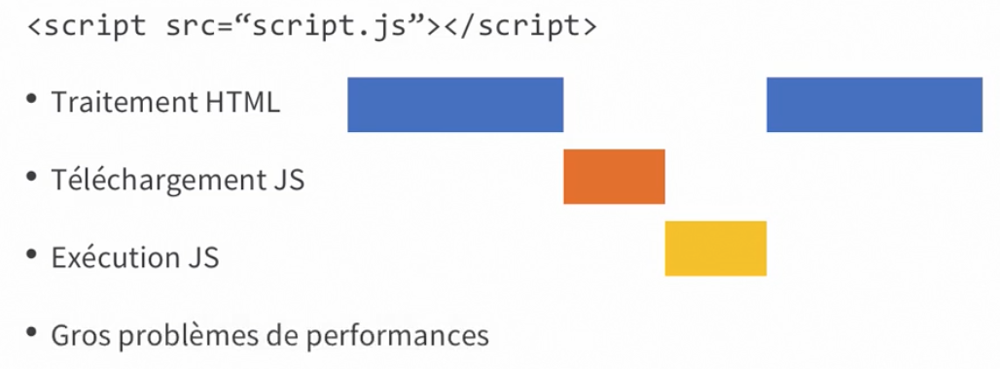
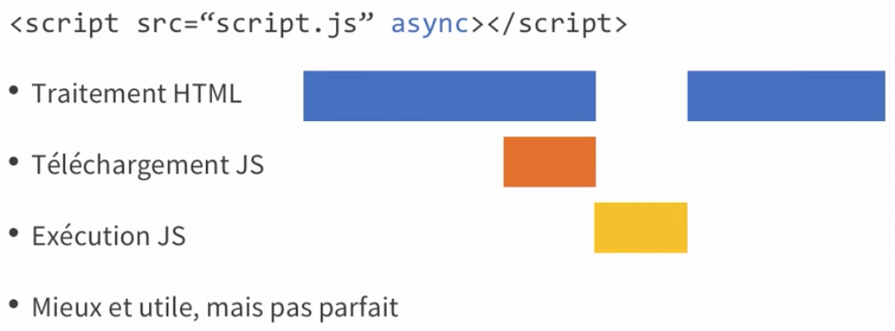
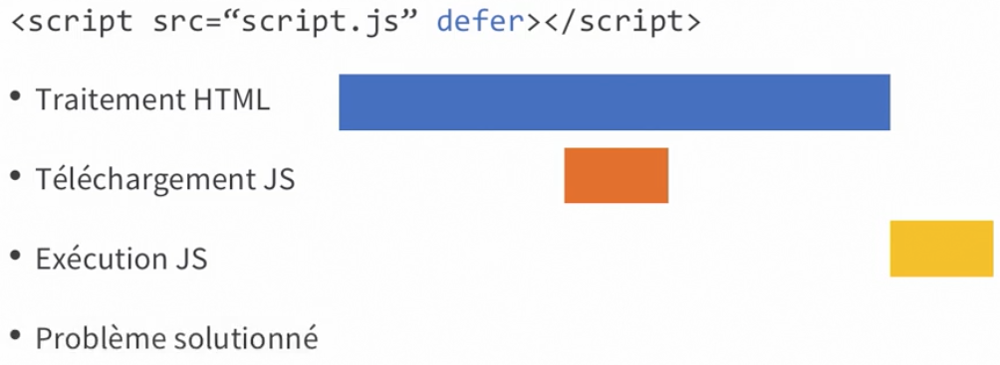
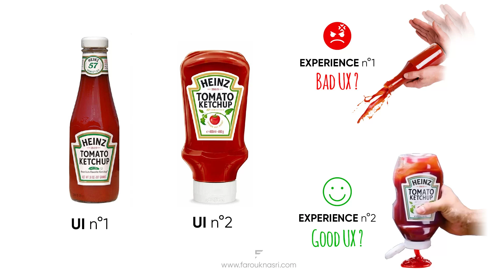
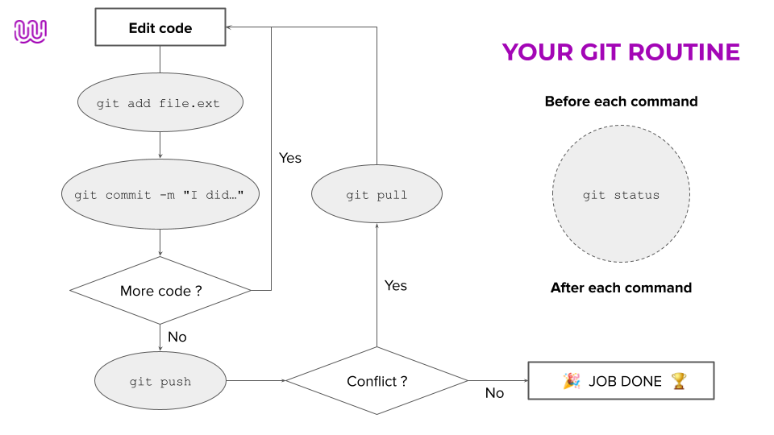
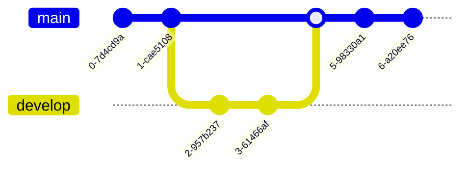

# Recap des journées

---

> **Note**
>
> Drives des dossiers communs & privés

|                                Lien Drive / Utiles                                 |
| :--------------------------------------------------------------------------------: |
| [Commun](https://drive.google.com/drive/folders/1wejsBzAh7XXAs3vILtkEtySmOM_eji-B) |
| [Privé](https://drive.google.com/drive/folders/1aKS-GDpFbZ3I-WOsLD7jLKwvS0Efvvuq)  |
|      [Wild Code School Workshop](https://wildcodeshool-workshop.netlify.app/)      |

---

## Saison 3️⃣

### :calendar: 26/03/2024

:package: _Récap du jour_


**REACT 👏👏👏**

**REACT 👏👏👏**

**REACT 👏👏👏**

Et oui, nous entamons la partie React de notre formation.

Alors qu'avons-nous vu aujourd'hui ?

### 💡Ce qu'il faut retenir

#### C'est quoi React ?

React est une **bibliothèque** JavaScript pour la construction d'interfaces utilisateur.

#### Pourquoi React ?

-   **Facile à apprendre** : React est facile à apprendre, surtout si vous avez des connaissances en HTML, CSS et JavaScript.
-   **Réutilisable** : React vous permet de créer des composants réutilisables.
-   **Performant** : React utilise une technique appelée DOM virtuel qui améliore les performances de l'application.

#### JSX

JSX est une extension de la syntaxe JavaScript qui permet d'écrire du HTML dans du JavaScript.
Alors le JSX ça ressemble à l'html, à l'odeur, à la couleur, mais ce n'est pas de l'html.

```js
const element = <h1>Hello, world!</h1>;
```

#### Les composants

Les composants sont les éléments de base de React. Ils permettent de diviser l'interface utilisateur en morceaux indépendants et réutilisables.

```js
function Welcome() {
	return <h1>Hello world!</h1>;
}
```

:link: _Liens utiles_

Le cours viendra plus tard, car il est assez long et je ne veux pas vous spoiler. 😎

-   [Workshop React](./assets/workshop1.png)
-   [JS-RemoteFR-CrewDragon-HtmlToReact](https://github.com/WildCodeSchool-2024-02/JS-RemoteFR-CrewDragon-HtmlToReact)

---

## Saison 2️⃣

### :calendar: 19/03/2024

:package: _Récap du jour_

Node.js, c'est quoi ? C'est un environnement d'exécution JavaScript côté serveur.

Node.js est basé sur le moteur JavaScript V8 de Chrome.

#### Comment ça marche ?

Pour utiliser Node.js, il faut installer Node.js sur votre machine => [Node.js](https://nodejs.org/en/)

Ensuite, vous pouvez écrire du code JavaScript dans un fichier `.js` et l'exécuter avec Node.js.

```shell
$ node
> console.log("Hello World !");
```

Pas terrible comme utilisation, du coup, nous allons utiliser plutôt un fichier.

```js
// index.js
console.log("Hello World !");
```

```shell
$ node index.js
# output
Hello World !
```

### NPM

[NPM](https://www.npmjs.com/) (Node Package Manager) est un gestionnaire de paquets pour Node.js.

Il permet d'installer des paquets (bibliothèques) pour Node.js.

```shell
$ npm install chalk@4.1.2
```

Détail de la commande :

-   `npm` : le gestionnaire de paquets
-   `install` : commande pour installer un paquet
-   `chalk` : le nom du paquet
-   `@4.1.2` : la version du paquet

Je prend la version 4.1.2 de chalk car la version 5 ou plus utilise ESM (ECMAScript Modules) et je ne veux pas vous embrouiller avec ça.

```js
// index.js
const chalk = require("chalk");

console.log(chalk.blue("Hello World !"));
```

:link: _Liens utiles_

-   [JS [FR] - What is Node?](https://docs.google.com/presentation/d/1ngtYXEY8nngkFq-SOg97Hq-wK7x-1OUKpm78ZLBZO7A/edit)
-   [Node.js](https://nodejs.org/en)
-   [npm | Home](https://www.npmjs.com/)

---

### :calendar: 14/03/2024

**Partie 2 / 2**

:package: _Récap du jour_

Encore rien de nouveau, mais ça ne fait pas de mal 😎

N'hésite pas à aller au [05/03/2024](#calendar-05032024), c'est quasiment le même cours.

### :bulb: Pour brillé en société

#### Optional chaining

L'opérateur de chaînage optionnel `?.` permet de lire la valeur d'une propriété située au sein d'une chaîne de connexion avec une valeur `null` ou `undefined` sans lever d'erreur.

```js
let user = {}; // l'utilisateur est sans nom

alert(user?.address?.street); // undefined (pas d'erreur)
```

Alors que sans l'opérateur de chaînage optionnel, nous aurions une erreur :

```js
let user = {}; // l'utilisateur est sans nom

alert(user.address.street); // Erreur !
```

#### Arrow function

Les fonctions fléchées sont des raccourcis pour déclarer des fonctions.

```js
// syntaxe
// ici, en plus de la syntaxe, nous avons un return implicite
let sum = (a, b) => a + b;

/* équivalent à */

let sum = function (a, b) {
	return a + b;
};
```

La différence entre `classic function` & `arrow function`

```js
const user = {
	name: "anthony",
	classicFunction: function () {
		console.log(this, this.name);
	},
	arrowFunction: () => {
		console.log(this, this.name);
	},
};

user.classicFunction();
user.arrowFunction();

/**********/
/* output */
/**********/

// {name: "anthony", classicFunction: ƒ, arrowFunction: ƒ} "anthony"

// Window {window: Window, self: Window, document: document, name: "", location: Location, …} undefined
```

Ce que ça veut dire, c'est que les fonctions fléchées n'ont pas de `this` propre, elles prennent le `this` de leur parent.

ET SURTOUT ! JAVA !== JAVASCRIPT

code java pour un hello world:

```java
public class HelloWorld {
  public static void main(String[] args) {
    System.out.println("Hello, World");
  }
}
```

code javascript pour un hello world:

```js
console.log("Hello, World");
```

Alors, c'est plus simple JS non ? :wink:

:link: _Liens utiles_

-   [JS [FR] - JS Basics](https://docs.google.com/presentation/d/1Nz2FAA4SaasV1qoXbTUPtjuJ8QvOoV1w76JBW9YN9Yw/edit)

---

### :calendar: 13/03/2024

**Partie 1 / 2**

:package: _Récap du jour_

Bon, rien de trop nouveau sous le soleil.
Mais on quand même vu les bases.

N'hésite pas à aller au [05/03/2024](#calendar-05032024), c'est quasiment le même cours.

:link: _Liens utiles_

-   [Can I use... Support tables for HTML5, CSS3, etc](https://caniuse.com/)
-   [Optional chaining (?.) - JavaScript | MDN](https://developer.mozilla.org/en-US/docs/Web/JavaScript/Reference/Operators/Optional_chaining)

### :calendar: 12/03/2024

:package: _Récap du jour_

<em>✨ Enfin la manipulation du DOM ✨</em>


### Ce qu'il faut retenir

Le DOM (Document Object Model) est une interface de programmation pour les documents HTML.

Il représente la page web sous forme d'arbre d'objets.

Nous avons besoins de 3 étapes pour manipuler le DOM :

1. **Sélectionner un élément**
2. **Ajouter un événement**
3. **Modifier le contenu**

#### Sélectionner un élément

Il existe plusieurs façons de sélectionner un élément :

-   `document.getElementById('id')`
-   `document.getElementsByClassName('class')`
-   `document.getElementsByTagName('tag')`

Moi je préfère utiliser les méthodes suivantes :

-   `document.querySelector('selecteur')`
-   `document.querySelectorAll('selecteur')`

#### Ajouter un événement

Il existe plusieurs type d'événements :

-   `click` : au clic
-   `change` : à la modification
-   `mouseover` : au survol
-   ...

#### Modifier le contenu

Il existe plusieurs manière de modifier le contenu :

-   `innerHTML` : permet de modifier le contenu HTML
-   `textContent` : permet de modifier le contenu textuel
-   `setAttribute` : permet de modifier un attribut
-   `style` : permet de modifier le style
-   ...

#### Comment fonctionne la balise script





### 💡 Pour brillé en société

#### IIFE

Ici, nous avons une fonction qui s'appel et s'execute directement.
On appelle ça une [IIFE](https://developer.mozilla.org/fr/docs/Glossary/IIFE) (Immediately Invoked Function Expression).

```js
//IIFE

(function () {
	//code
})();
```

:link: _Liens utiles_

-   [JS [FR] - DOM basics](https://docs.google.com/presentation/d/1oKNELlK8d8x4fcGj_w0m6lmCbxS3ZKvtnibw8b7jjxg/edit)
-   [DOM workshop | Wild code school](https://wildcodeschool.github.io/workshop-js-dom/)
-   [GorskiAnthony/tp-todo](https://github.com/GorskiAnthony/tp-todo)

## Saison 1

### :calendar: 08/03/2024

:package: _Récap du jour_

_Comment faire une bonne démo_ voilà le thème abordé aujourd'hui.

Nous avons vu ce qu'il fallait faire et ne pas faire lors d'une démo. ⬇️

-   [x] N’attendez pas la dernière minute
-   [x] Soyez clair et concis
-   [x] Appuyez-vous sur votre support
-   [x] Adaptez-vous à votre interlocuteur
-   [x] Préparez la répartition de la parole
-   [x] Anticipez les questions / réponses
-   [x] Entraînez-vous !!!!!

Nous commençons aussi les press reviews.
Chaque semaine, vous devez parler d'un sujet en relation avec le dev'.

-   Un fait d'actualité
-   Un nouvel outil
-   Un framework
-   Etc.

:link: _Liens utiles_

-   [Onboarding [FR] - How to do a good demo](https://docs.google.com/presentation/d/1ZaYBN_BnKqAhBKcG_FMNP3coTk_nVaEaS7qPf3Dq12U/edit#slide=id.p1)

### :calendar: 07/03/2024

:package: _Récap du jour_

Nous avons vu aujourd'hui comment passer des wireframes papier vers un prototype sur figma ainsi que les bonnes pratiques UX/UI.

Pour rappel :



:link: _Liens utiles_

-   [UX/UI [FR] - Website conception](https://docs.google.com/presentation/d/1cMJyttPWY6dyjU3bPfMU1VVeP-yQQzK0LHRL1CR1IjU/edit#slide=id.p)
-   [UX/UI [FR] - Web design](https://docs.google.com/presentation/d/1EqV-WMtcyuntKUYJnZC7G9N49gnrZvjvGvcZr9BOfPw/edit#slide=id.p)

---

-   [Analyse et vérification du contraste | Adobe Color](https://color.adobe.com/fr/create/color-contrast-analyzer)
-   [User Inyerface - A worst-practice UI experiment](https://userinyerface.com/)

---

Merci à [Fanny](https://github.com/fanny-pretre) pour les liens suivants :

-   [Définition de la Loi de Fitts, son rôle dans l'expérience utilisateur (UX)](https://www.usabilis.com/definition-loi-de-fitts/)
-   [color.adobe.com/fr/trends](https://color.adobe.com/fr/trends)
-   [Les lois de la Gestalt appliquées au Design | bluedrop.fr, Agence web Drupal - Usinons Drupal](https://www.bluedrop.fr/content/les-lois-de-la-gestalt-appliqu%C3%A9es-au-design#:~:text=Cette%20th%C3%A9orie%20cherche%20%C3%A0%20expliquer,une%20vision%20globale%20des%20choses)

---

-   [WAVE Evaluation Tool](https://chromewebstore.google.com/detail/wave-evaluation-tool/jbbplnpkjmmeebjpijfedlgcdilocofh)

### :calendar: 06/03/2024

:package: _Récap du jour_

#### C'est quoi git & github ❓

`Git` est un logiciel de versionning, c'est à dire qu'il permet de gérer les versions de notre code, il est en local.

`Github` est un service en ligne qui permet de stocker notre code en ligne.

#### Les commandes de bases

| commande                  | description                                 |
| ------------------------- | ------------------------------------------- |
| `git init`                | permet d'initialiser un repo git            |
| `git add .`               | permet d'ajouter tous les fichiers au stage |
| `git commit -m "message"` | permet de créer un commit                   |
| `git push`                | permet d'envoyer le code sur github         |
| `git pull`                | permet de récupérer le code sur github      |
| `git status`              | permet de voir l'état du repo git           |
| `git checkout`            | permet de changer de branche                |
| `git switch`              | depuis la version 2.23                      |
| `git branch`              | permet de créer une branche                 |



Si vous souhaitez avoir un git cheat sheet, voici le lien : [Git Cheat Sheet](./assets/git-cheat-sheet-education.png)



Ensuite, à vous l'atelier git & github !

:link: _Liens utiles_

-   [Git / GitHub [FR] - Intro](https://docs.google.com/presentation/d/1e4G26qbY_5vGG0l9w05TCuIv_Kkw-bxFeZ4Q1hc6xFs/edit#slide=id.p)

---

-   [WorkShop Chip & Dale](https://wildcodeschool.github.io/workshop-git/README-FR)

---

-   [SSH Key & Git by Antho](./assets/GIT.pdf)
-   [Apprendre Git](https://learngitbranching.js.org/?locale=fr_FR)
-   [Simple Git Workflow | Wild code school](https://wildcodeschool.github.io/workflow-project-1/README-FR)

### :calendar: 05/03/2024

:package: _Récap du jour_

✨ _LES BASES PROGRAMMATIONS_ ✨


Alors, oui, c'est assez dur, il y a plein de choses à connaître, mais en vrai. Çaaa vaaaaa !

Les éléments communs pour tout le monde :

-   Les variables
-   Les conditions
-   Les tableaux
-   Les boucles
-   Les fonctions
-   🎁 les 6 falsy values

#### Les variables

Une variable est un espace mémoire qui permet de stocker une valeur.

```js
let maVariable = "Hello World !";
```

Attention, quand une variable est réassignée, elle perd sa valeur précédente.

```js
let prenom = "anthony";

prenom = "samuel";
```

anthony est remplacé par samuel.


#### Les types de données

Il existe plusieurs types de données :

Les primitifs :

-   `string` : chaîne de caractères
-   `number` : nombre
-   `boolean` : vrai ou faux
-   `null` : nul
-   `undefined` : non défini
-   ...

Les non primitifs :

-   `object` : objet
-   `array` : tableau
-   `function` : fonction
-   ...

#### Les opérateurs

Il y a les opérateurs mathématiques que vous connaissez déjà, mais il y en a d'autres.

Voilà le lien pour les opérateurs : [Opérateurs](https://developer.mozilla.org/fr/docs/Web/JavaScript/Guide/Expressions_et_Op%C3%A9rateurs)

#### Les tableaux

Les tableaux permettent de stocker plusieurs valeurs.

```js
let monTableau = [2, "Hello", true, ["coucou"]];
```

Il existent plusieurs méthodes pour manipuler les tableaux :

-   `push()` : ajoute un élément à la fin du tableau
-   `pop()` : supprime le dernier élément du tableau
-   `shift()` : supprime le premier élément du tableau
-   `unshift()` : ajoute un élément au début du tableau

#### Les conditions

Les conditions permettent de faire des choix dans le code.

L'architecture d'un `if/else`:

```js
// Une condition doit obligatoirement se répondre par true ou false
if (condition) {
	// code
} else if (condition) {
	// code
} else {
	// code
}
```

Ex:

```js
let maVariable = "Bouh";

if (maVariable === "Hello World !") {
	console.log("C'est cool !");
} else {
	console.log("C'est pas cool !");
}
```

💡 Astuce !

Si votre condition est un booléen (`true` ou `false`), vous pouvez faire comme ça :

```js
let maVariable = true;

if (maVariable) {
	console.log("C'est cool !");
} else {
	console.log("C'est pas cool !");
}
```

Ou encore :

```js
if (!maVariable) {
	console.log("C'est pas cool !");
} else {
	console.log("C'est cool !");
}
```

#### Les boucles

Les boucles permettent de répéter une action.

Il y a 3 informations importantes :

-   L'initialisation
-   La condition d'arrêt
-   L'incrémentation

`Boucle for`:

```js
for (let i = 0; i < 10; i++) {
	console.log(i);
}
```

`Boucle while & do while`: (attention à ne pas faire de boucle infinie !)

```js
let i = 0;

while (condition) {
	// code

	i++;
}
```

```js
let i = 0;

do {
	// code
	i++;
} while (condition);
```

Il existe tout un tas d'autre façon de boucler, mais ce sont les plus courants.

#### Les fonctions

Les fonctions permettent de réutiliser du code.

La syntaxe :


-   `function` : mot clé pour déclarer une fonction
-   `maFonction` : nom de la fonction
-   `()` : les paramètres
-   `{}` : le corps de la fonction

```js
function maFonction() {
	console.log("Hello World !");
}

/* réutilisation de la fonction maFonction */
maFonction();
maFonction();
```


⚠️ Attention, une fonction qui ne fait qu'un `console.log()` ne sert à rien !
Il faut que la fonction retourne (`return`) une valeur.

```js
function maFonction() {
	return "Hello World !";
}
```

Et pour récupérer la valeur de la fonction :

```js
let maVariable = maFonction();
```

<details>
  <summary>Un exemple qui regroupe plein d'info 😎</summary>

```js
// ma variable students qui est un tableau d'étudiants
const students = [
	"Aurélien",
	"Mohamed",
	"Laurent",
	"Frank",
	"Kelly",
	"Fanny",
	"Amandine",
	"Vincent",
	"David",
	"Baptiste",
	"Sacha",
	"Nicolas",
	"Kylian",
	"Fab",
	"Jeviraj",
	"Simon",
];

// une fonction sayHello qui prend 1 paramètre `name`
function sayHello(name) {
	console.log("Coucou " + name + " 👋");
}

// Une boucle for qui commence à 0 jusqu'à la taille du tableau
for (let i = 0; i < students.length; i += 1) {
	// utilisation de la fonction sayHello qui prend un argument
	// students[i] qui vaut le prénom de mon tableau "students" à l'index `i`
	sayHello(students[i]);
}
```

</details>

#### 🎁 Les 6 falsy values

Les 6 falsy values sont des valeurs qui sont évaluées à `false` dans une condition.

-   `false`
-   `0`
-   `""`
-   `null`
-   `undefined`
-   `NaN`

Si vous voulez en savoir plus, voici un article qui en parle : [Les 6 falsy values](https://developer.mozilla.org/fr/docs/Glossaire/Falsy)

:link: _Liens utiles_

-   [Programming Basics [FR]](https://docs.google.com/presentation/d/1OBivzxzUzk8J5-L93OMpW0ObVeInsFYmmluh9J0UeBE/edit)
-   [Programming Basics | Wild code school](https://wildcodeschool.github.io/workshop-programming-basics/)

### :calendar: 01/03/2024

:package: _Récap du jour_

Notre petit cours d'aujourd'hui était sur les bases du web.
Le principe est de comprendre comment fonctionne le web, et ainsi, faire la différence entre le `web` et `internet`.

### 💡Ce qu'il faut retenir

**Web**

Le web est un système de publication et de consultation de documents hypertextes liés entre eux et accessibles via le réseau internet.

**Internet**

Internet est un réseau informatique mondial accessible au public. Il permet de partager des informations et des ressources.

**Protocoles**

-   HTTP(S) : Hypertext Transfer Protocol (Secure)
-   FTP : File Transfer Protocol
-   etc.

**Navigateur**

Un navigateur web est un logiciel permettant de consulter des pages web. Les plus connus sont Chrome, Firefox, Safari, Edge, Opera.

**URL**

Une URL (Uniform Resource Locator) est une adresse web. Elle est composée de plusieurs éléments :

-   Protocole : `http://` ou `https://`
-   Nom de domaine : `www.google.com`
-   Chemin : `/search?q=hello+world`

### Bonus


:link: _Liens utiles_

-   [Web [FR] - Web Basics](https://docs.google.com/presentation/d/1fDH6eD-udpIGQ8b_LF2CLQCJwN94Bj_h33K4MmD6xMo/edit#slide=id.p)

### :calendar: 29/02/2024

:package: _Récap du jour_

Nouvelle connaissance débloquée : Le Terminal.


Oui, le terminal est un outil puissant, mais il peut être intimidant au début. C'est pourquoi nous avons vu les bases pour vous aider à vous familiariser avec cet outil.

### 💡Ce qu'il faut retenir

Le kit de survie du terminal :

| Commande  | Description                                          |
| --------- | ---------------------------------------------------- |
| `pwd`     | affiche le répertoire courant                        |
| `ls`      | liste les fichiers et dossiers du répertoire courant |
| `cd`      | change de répertoire                                 |
| `mkdir`   | crée un dossier                                      |
| `touch`   | crée un fichier                                      |
| `rm`      | supprime un fichier                                  |
| `rm -r`   | supprime un dossier                                  |
| `mv`      | déplace un fichier ou un dossier                     |
| `cp`      | copie un fichier ou un dossier                       |
| `cat`     | affiche le contenu d'un fichier                      |
| `echo`    | affiche un message à l'écran                         |
| `clear`   | efface le terminal                                   |
| `.`       | répertoire courant                                   |
| `..`      | répertoire parent                                    |
| `man`     | affiche le manuel d'une commande                     |
| `history` | affiche l'historique des commandes                   |

Bien sûr, il y a beaucoup plus de commandes, mais ce sont les bases pour commencer.

:link: _Liens utiles_

-   [Web [FR] - Terminal](https://docs.google.com/presentation/d/1LWyNTqUL8qsP2bRF5a9V--iGav9wt2Q2b08on67Coz8/edit#slide=id.p)

---

-   [Voyage au centre de l’ordinateur | Wild code school](https://wildcodeschool.github.io/workshop-terminal/README-FR#conna%C3%AEtre-ses-racines)
-   [Exo console](https://www.notion.so/anthony-gorski/Console-bf80d102e2dd4a039a4a8f752cce619e)

### :calendar: 28/02/2024

:package: _Récap du jour_

Ladies and gentlemen, aujourd'hui, nous avons vu les bases du responsive design.


Le responsive, c'est la capacité d'un site web à s'adapter à la taille de l'écran de l'utilisateur. C'est un élément essentiel pour un site web, car il est important que le site soit lisible sur tous les supports.

Nous avons parler des grids et flexbox, qui sont des outils de mise en page en CSS. Ils permettent de créer des mises en page complexes et de les rendre responsive.

### 💡Ce qu'il faut retenir

Voilà un petit récap des breakpoints (points de rupture) les plus utilisés :


:link: _Liens utiles_

-   [CSS [FR] - Responsive Web Design](https://docs.google.com/presentation/d/1Uk_vi8dYmhXGHFg32Bdd-8PSTNGaqF_EibH_Lum6-bI/edit)

---

-   [Am I Responsive?](https://ui.dev/amiresponsive?url=https://www.wildcodeschool.com/fr-fr/)
-   [Interactive CSS Grid Generator | Layoutit Grid](https://grid.layoutit.com/)
-   [:root - CSS : Feuilles de style en cascade | MDN](https://developer.mozilla.org/fr/docs/Web/CSS/:root)

### :calendar: 27/02/2024

:package: _Récap du jour_

Aujourd'hui, nous avons vu les bases de l'HTML et du CSS et comment lier les deux.

Je vous rassure, il n'est pas nécessaire de tout retenir, mais il est important de comprendre les concepts de base.

### 💡Ce qu'il faut retenir

-   HTML : c'est la structure de la page web
-   CSS : c'est la mise en forme de la page web
-   Les balises HTML sont des éléments de structure
    -   `<h1></h1>` : titre de niveau 1
    -   `<p></p>` : paragraphe
    -   `<a></a>` : lien
    -   `` : image
    -   etc.
-   Les sélecteurs CSS permettent de cibler des éléments HTML
    -   `h1` : cible tous les titres de niveau 1
    -   `.ma__classe` : cible tous les éléments ayant la classe `class="ma__classe"`
    -   `#mon__id` : cible l'élément ayant l'id `id="mon__id"`

```html
<!DOCTYPE html>
<html>
	<head>
		<title>Titre de la page</title>
		<link rel="stylesheet" type="text/css" href="style.css" />
	</head>
	<body>
		<h1>Titre de la page</h1>
		<p>Un paragraphe</p>
	</body>
</html>
```

```css
h1 {
	color: blue;
	font-size: 12px;
}
```

Concernant les propriétés CSS, il est important de comprendre qu'il est impossible de toutes les retenir. C'est pourquoi il est essentiel de savoir où trouver les informations.
L'anglais est un atout pour la programmation, car la majorité des ressources sont en anglais.

:link: _Liens utiles_

-   [HTML [FR] - Basics](https://docs.google.com/presentation/d/1N-yUZcQfiuh8nInZXnB5D5uTaua9Tp4IYMk98IJ_yuY/edit#slide=id.p)
-   [CSS [FR] - Basics](https://docs.google.com/presentation/d/1-t0tqyjMs-FwVG723MSuzYAoKEra8LSZ-sRxADr1F64/edit#slide=id.p)

---

-   [W3Schools Online Web Tutorials](https://www.w3schools.com/)
-   [HTML Reference](https://www.w3schools.com/tags/default.asp)
-   [CSS Reference](https://www.w3schools.com/cssref/index.php)
-   [Méthodologie BEM pour le CSS](https://alticreation.com/bem-pour-le-css/)

---

-   [Flexbox Froggy - Un jeu pour apprendre les flexbox CSS](https://flexboxfroggy.com/#fr)
-   [Grid Garden - Un jeu pour apprendre les grid CSS](https://cssgridgarden.com/#fr)
-   [CSS Diner - Un jeu pour apprendre les sélecteurs CSS](https://flukeout.github.io/)
-   [CSS Battle - Un jeu pour apprendre le CSS](https://cssbattle.dev/)
-   [Codepen - Un site pour partager du code HTML/CSS/JS](https://codepen.io/)

### :calendar: 26/02/2024

:package: _Récap du jour_

Hello 👋 !

Aujourd'hui c'est présentation ! Ensuite, on continue avec une petite présentation des cursus JS & PHP

Vous avez même eu le mot du CEO de la Wild Code School !

:link: _Liens utiles_

-   [2024 - Programme des prochains mois](https://docs.google.com/presentation/d/1ppBPDll3PK0LSY3AFHG_zzGX5GoIEg-rARVEWTH9yKM/edit#slide=id.g210c0f5cbca_0_0)
-   [FR. 2024 Méthodes d'enseigement](https://docs.google.com/presentation/d/1-TWa72u96FVZxeBPs_FwLJIwy8M7JuNd9PBrbO6DpCU/edit#slide=id.p1)
