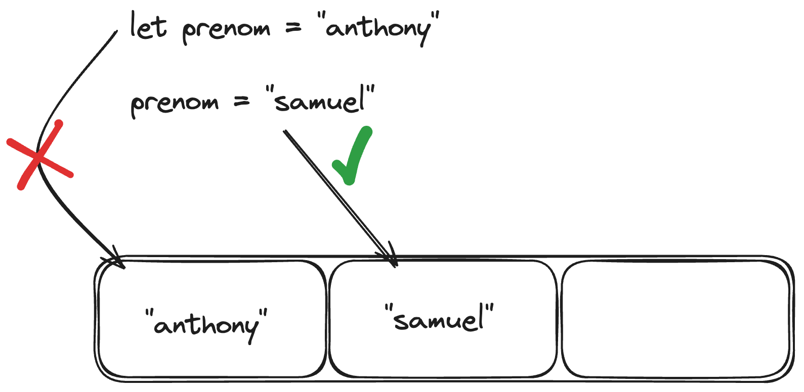
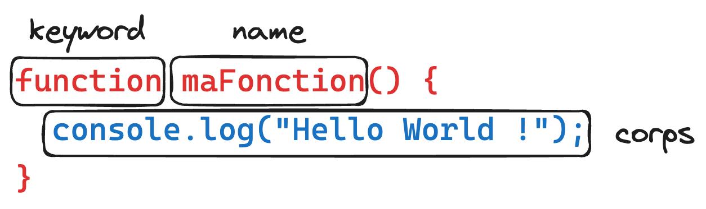
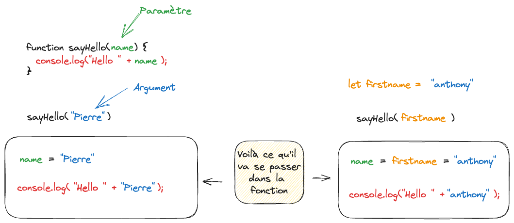
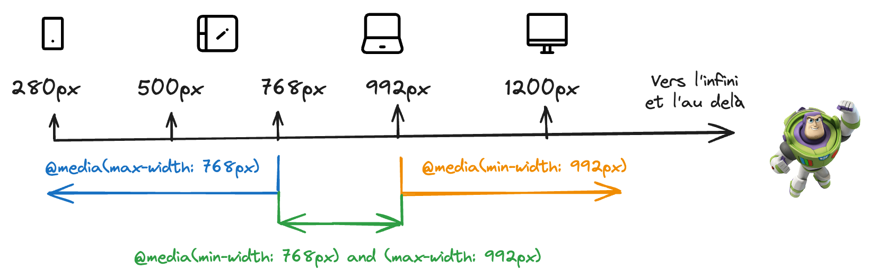

# Recap des journées

---

> **Note**
>
> Drives des dossiers communs & privés

|                                Lien Drive / Utiles                                 |
| :--------------------------------------------------------------------------------: |
| [Commun](https://drive.google.com/drive/folders/1wejsBzAh7XXAs3vILtkEtySmOM_eji-B) |
| [Privé](https://drive.google.com/drive/folders/1aKS-GDpFbZ3I-WOsLD7jLKwvS0Efvvuq)  |
|      [Wild Code School Workshop](https://wildcodeshool-workshop.netlify.app/)      |

---

## Saison 1

### :calendar: 05/03/2024

:package: _Récap du jour_

✨ _LES BASES PROGRAMMATIONS_ ✨


Alors oui, c'est assez dure, il y a plein de chose à connaitre, mais en vrai. Çaaa vaaaaa !

Les éléments communs pour tout le monde :

- Les variables
- Les conditions
- Les tableaux
- Les boucles
- Les fonctions
- 🎁 les 6 falsy values

#### Les variables

Une variable est un espace mémoire qui permet de stocker une valeur.

```js
let maVariable = "Hello World !";
```

Attention, quand une variable est réassignée, elle perd sa valeur précédente.

```js
let prenom = "anthony";

prenom = "samuel";
```

anthony est remplacé par samuel.



#### Les types de données

Il existe plusieurs types de données :

Les primitifs :

- `string` : chaîne de caractères
- `number` : nombre
- `boolean` : vrai ou faux
- `null` : nul
- `undefined` : non défini
- ...

Les non primitifs :

- `object` : objet
- `array` : tableau
- `function` : fonction
- ...

#### Les opérateurs

Il y a les opérateurs mathématiques que vous connaissez déja, mais il y en a d'autres.

Voilà le lien pour les opérateurs : [Opérateurs](https://developer.mozilla.org/fr/docs/Web/JavaScript/Guide/Expressions_et_Op%C3%A9rateurs)

#### Les tableaux

Les tableaux permettent de stocker plusieurs valeurs.

```js
let monTableau = [2, "Hello", true, ["coucou"]];
```

Il exitent plusieurs méthodes pour manipuler les tableaux :

- `push()` : ajoute un élément à la fin du tableau
- `pop()` : supprime le dernier élément du tableau
- `shift()` : supprime le premier élément du tableau
- `unshift()` : ajoute un élément au début du tableau

#### Les conditions

Les conditions permettent de faire des choix dans le code.

L'architecture d'un `if/else`:

```js
// Une condition doit obligatoirement se répondre par true ou false
if (condition) {
  // code
} else if (condition) {
  // code
} else {
  // code
}
```

Ex:

```js
let maVariable = "Bouh";

if (maVariable === "Hello World !") {
  console.log("C'est cool !");
} else {
  console.log("C'est pas cool !");
}
```

💡 Astuce !

Si votre condition est un booléen (`true` ou `false`), vous pouvez faire comme ça :

```js
let maVariable = true;

if (maVariable) {
  console.log("C'est cool !");
} else {
  console.log("C'est pas cool !");
}
```

Ou encore :

```js
if (!maVariable) {
  console.log("C'est pas cool !");
} else {
  console.log("C'est cool !");
}
```

#### Les boucles

Les boucles permettent de répéter une action.

Il y a 3 informations importantes :

- L'initialisation
- La condition d'arrêt
- L'incrémentation

`Boucle for`:

```js
for (let i = 0; i < 10; i++) {
  console.log(i);
}
```

`Boucle while & do while`: (attention à ne pas faire de boucle infinie !)

```js
let i = 0;

while (condition) {
  // code

  i++;
}
```

```js
let i = 0;

do {
  // code
  i++;
} while (condition);
```

Il existe tout un tas d'autre façon de boucler, mais ce sont les plus courants.

#### Les fonctions

Les fonctions permettent de réutiliser du code.

La syntaxe :



- `function` : mot clé pour déclarer une fonction
- `maFonction` : nom de la fonction
- `()` : les paramètres
- `{}` : le corps de la fonction

```js
function maFonction() {
  console.log("Hello World !");
}

/* réutilisation de la fonction maFonction */
maFonction();
maFonction();
```



⚠️ Attention, une fonction qui ne fait qu'un `console.log()` ne sert à rien !
Il faut que la fonction retourne (`return`) une valeur.

```js
function maFonction() {
  return "Hello World !";
}
```

Et pour récupérer la valeur de la fonction :

```js
let maVariable = maFonction();
```

<details>
  <summary>Un exemple qui regroupe plein d'info 😎</summary>

```js
// ma variable students qui est un tableau d'étudiants
const students = [
  "Aurélien",
  "Mohamed",
  "Laurent",
  "Frank",
  "Kelly",
  "Fanny",
  "Amandine",
  "Vincent",
  "David",
  "Baptiste",
  "Sacha",
  "Nicolas",
  "Kylian",
  "Fab",
  "Jeviraj",
  "Simon",
];

// une fonction sayHello qui prend 1 paramètre `name`
function sayHello(name) {
  console.log("Coucou " + name + " 👋");
}

// Une boucle for qui commence à 0 jusqu'à la taille du tableau
for (let i = 0; i < students.length; i += 1) {
  // utilisation de la fonction sayHello qui prend un argument
  // students[i] qui vaut le prénom de mon tableau "students" à l'index `i`
  sayHello(students[i]);
}
```

</details>

#### 🎁 Les 6 falsy values

Les 6 falsy values sont des valeurs qui sont évaluées à `false` dans une condition.

- `false`
- `0`
- `""`
- `null`
- `undefined`
- `NaN`

Si vous voulez en savoir plus, voici un article qui en parle : [Les 6 falsy values](https://developer.mozilla.org/fr/docs/Glossaire/Falsy)

:link: _Liens utiles_

- [Programming Basics [FR]](https://docs.google.com/presentation/d/1OBivzxzUzk8J5-L93OMpW0ObVeInsFYmmluh9J0UeBE/edit)
- [Programming Basics | Wild code school](https://wildcodeschool.github.io/workshop-programming-basics/)

### :calendar: 01/03/2024

:package: _Récap du jour_

Notre petit cours d'aujourd'hui était sur les bases du web.
Le principe est de comprendre comment fonctionne le web, et ainsi, faire la différence entre le `web` et `internet`.

### 💡Ce qu'il faut retenir

**Web**

Le web est un système de publication et de consultation de documents hypertextes liés entre eux et accessibles via le réseau internet.

**Internet**

Internet est un réseau informatique mondial accessible au public. Il permet de partager des informations et des ressources.

**Protocoles**

- HTTP(S) : Hypertext Transfer Protocol (Secure)
- FTP : File Transfer Protocol
- etc.

**Navigateur**

Un navigateur web est un logiciel permettant de consulter des pages web. Les plus connus sont Chrome, Firefox, Safari, Edge, Opera.

**URL**

Une URL (Uniform Resource Locator) est une adresse web. Elle est composée de plusieurs éléments :

- Protocole : `http://` ou `https://`
- Nom de domaine : `www.google.com`
- Chemin : `/search?q=hello+world`

### Bonus


:link: _Liens utiles_

- [Web [FR] - Web Basics](https://docs.google.com/presentation/d/1fDH6eD-udpIGQ8b_LF2CLQCJwN94Bj_h33K4MmD6xMo/edit#slide=id.p)

### :calendar: 29/02/2024

:package: _Récap du jour_

Nouvelle connaissance débloquée : Le Terminal.


Oui, le terminal est un outil puissant, mais il peut être intimidant au début. C'est pourquoi nous avons vu les bases pour vous aider à vous familiariser avec cet outil.

### 💡Ce qu'il faut retenir

Le kit de survie du terminal :

| Commande  | Description                                          |
| --------- | ---------------------------------------------------- |
| `pwd`     | affiche le répertoire courant                        |
| `ls`      | liste les fichiers et dossiers du répertoire courant |
| `cd`      | change de répertoire                                 |
| `mkdir`   | crée un dossier                                      |
| `touch`   | crée un fichier                                      |
| `rm`      | supprime un fichier                                  |
| `rm -r`   | supprime un dossier                                  |
| `mv`      | déplace un fichier ou un dossier                     |
| `cp`      | copie un fichier ou un dossier                       |
| `cat`     | affiche le contenu d'un fichier                      |
| `echo`    | affiche un message à l'écran                         |
| `clear`   | efface le terminal                                   |
| `.`       | répertoire courant                                   |
| `..`      | répertoire parent                                    |
| `man`     | affiche le manuel d'une commande                     |
| `history` | affiche l'historique des commandes                   |

Bien sûr, il y a beaucoup plus de commandes, mais ce sont les bases pour commencer.

:link: _Liens utiles_

- [Web [FR] - Terminal](https://docs.google.com/presentation/d/1LWyNTqUL8qsP2bRF5a9V--iGav9wt2Q2b08on67Coz8/edit#slide=id.p)

---

- [Voyage au centre de l’ordinateur | Wild code school](https://wildcodeschool.github.io/workshop-terminal/README-FR#conna%C3%AEtre-ses-racines)
- [Exo console](https://www.notion.so/anthony-gorski/Console-bf80d102e2dd4a039a4a8f752cce619e)

### :calendar: 28/02/2024

:package: _Récap du jour_

Ladies and gentlemen, aujourd'hui, nous avons vu les bases du responsive design.


Le responsive, c'est la capacité d'un site web à s'adapter à la taille de l'écran de l'utilisateur. C'est un élément essentiel pour un site web, car il est important que le site soit lisible sur tous les supports.

Nous avons parler des grids et flexbox, qui sont des outils de mise en page en CSS. Ils permettent de créer des mises en page complexes et de les rendre responsive.

### 💡Ce qu'il faut retenir

Voilà un petit récap des breakpoints (points de rupture) les plus utilisés :



:link: _Liens utiles_

- [CSS [FR] - Responsive Web Design](https://docs.google.com/presentation/d/1Uk_vi8dYmhXGHFg32Bdd-8PSTNGaqF_EibH_Lum6-bI/edit)

---

- [Am I Responsive?](https://ui.dev/amiresponsive?url=https://www.wildcodeschool.com/fr-fr/)
- [Interactive CSS Grid Generator | Layoutit Grid](https://grid.layoutit.com/)
- [:root - CSS : Feuilles de style en cascade | MDN](https://developer.mozilla.org/fr/docs/Web/CSS/:root)

### :calendar: 27/02/2024

:package: _Récap du jour_

Aujourd'hui, nous avons vu les bases de l'HTML et du CSS et comment lier les deux.

Je vous rassure, il n'est pas nécessaire de tout retenir, mais il est important de comprendre les concepts de base.

### 💡Ce qu'il faut retenir

- HTML : c'est la structure de la page web
- CSS : c'est la mise en forme de la page web
- Les balises HTML sont des éléments de structure
  - `<h1></h1>` : titre de niveau 1
  - `<p></p>` : paragraphe
  - `<a></a>` : lien
  - `` : image
  - etc.
- Les sélecteurs CSS permettent de cibler des éléments HTML
  - `h1` : cible tous les titres de niveau 1
  - `.ma__classe` : cible tous les éléments ayant la classe `class="ma__classe"`
  - `#mon__id` : cible l'élément ayant l'id `id="mon__id"`

```html
<!doctype html>
<html>
  <head>
    <title>Titre de la page</title>
    <link rel="stylesheet" type="text/css" href="style.css" />
  </head>
  <body>
    <h1>Titre de la page</h1>
    <p>Un paragraphe</p>
  </body>
</html>
```

```css
h1 {
  color: blue;
  font-size: 12px;
}
```

Concernant les propriétés CSS, il est important de comprendre qu'il est impossible de toutes les retenir. C'est pourquoi il est essentiel de savoir où trouver les informations.
L'anglais est un atout pour la programmation, car la majorité des ressources sont en anglais.

:link: _Liens utiles_

- [HTML [FR] - Basics](https://docs.google.com/presentation/d/1N-yUZcQfiuh8nInZXnB5D5uTaua9Tp4IYMk98IJ_yuY/edit#slide=id.p)
- [CSS [FR] - Basics](https://docs.google.com/presentation/d/1-t0tqyjMs-FwVG723MSuzYAoKEra8LSZ-sRxADr1F64/edit#slide=id.p)

---

- [W3Schools Online Web Tutorials](https://www.w3schools.com/)
- [HTML Reference](https://www.w3schools.com/tags/default.asp)
- [CSS Reference](https://www.w3schools.com/cssref/index.php)
- [Méthodologie BEM pour le CSS](https://alticreation.com/bem-pour-le-css/)

---

- [Flexbox Froggy - Un jeu pour apprendre les flexbox CSS](https://flexboxfroggy.com/#fr)
- [Grid Garden - Un jeu pour apprendre les grid CSS](https://cssgridgarden.com/#fr)
- [CSS Diner - Un jeu pour apprendre les sélecteurs CSS](https://flukeout.github.io/)
- [CSS Battle - Un jeu pour apprendre le CSS](https://cssbattle.dev/)
- [Codepen - Un site pour partager du code HTML/CSS/JS](https://codepen.io/)

### :calendar: 26/02/2024

:package: _Récap du jour_

Hello 👋 !

Aujourd'hui c'est présentation ! Ensuite, on continue avec une petite présentation des cursus JS & PHP

Vous avez même eu le mot du CEO de la Wild Code School !

:link: _Liens utiles_

- [2024 - Programme des prochains mois](https://docs.google.com/presentation/d/1ppBPDll3PK0LSY3AFHG_zzGX5GoIEg-rARVEWTH9yKM/edit#slide=id.g210c0f5cbca_0_0)
- [FR. 2024 Méthodes d'enseigement](https://docs.google.com/presentation/d/1-TWa72u96FVZxeBPs_FwLJIwy8M7JuNd9PBrbO6DpCU/edit#slide=id.p1)
